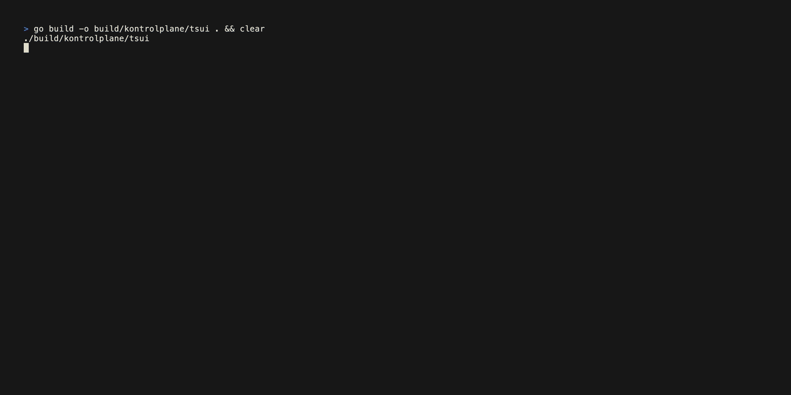
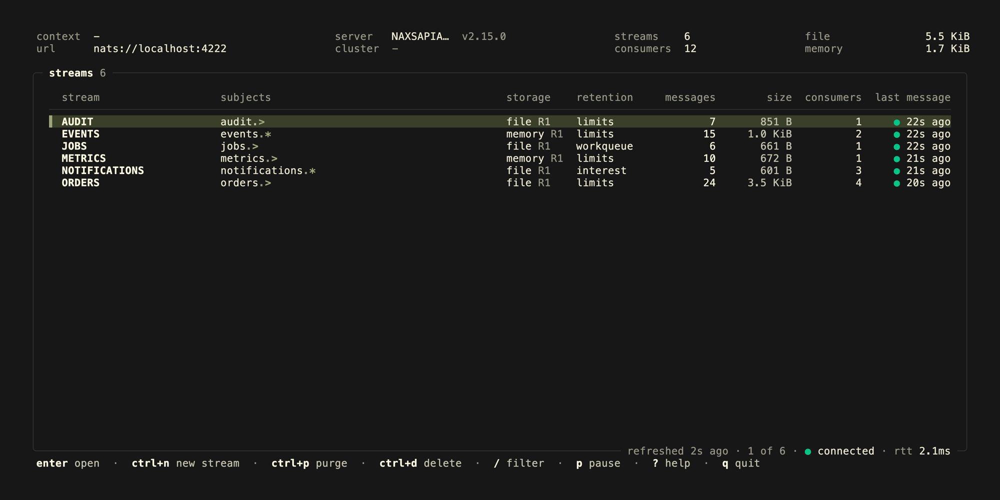
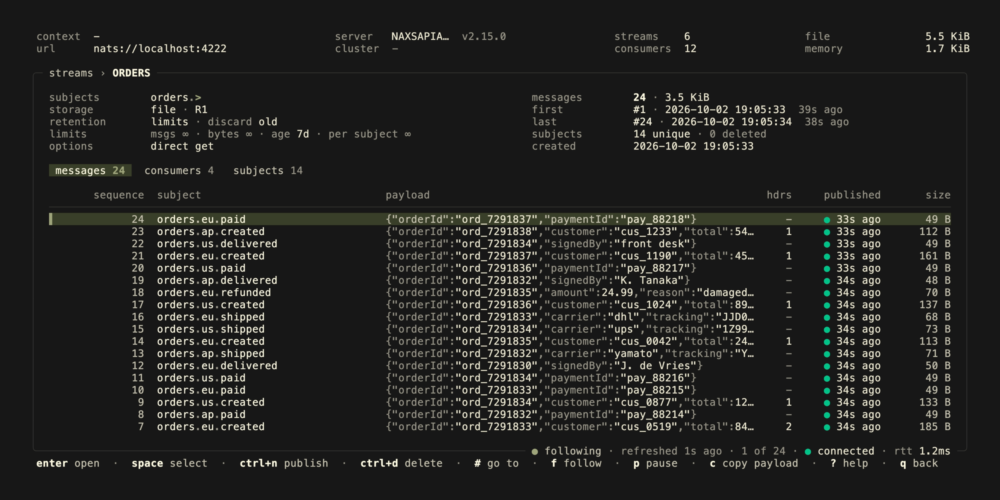
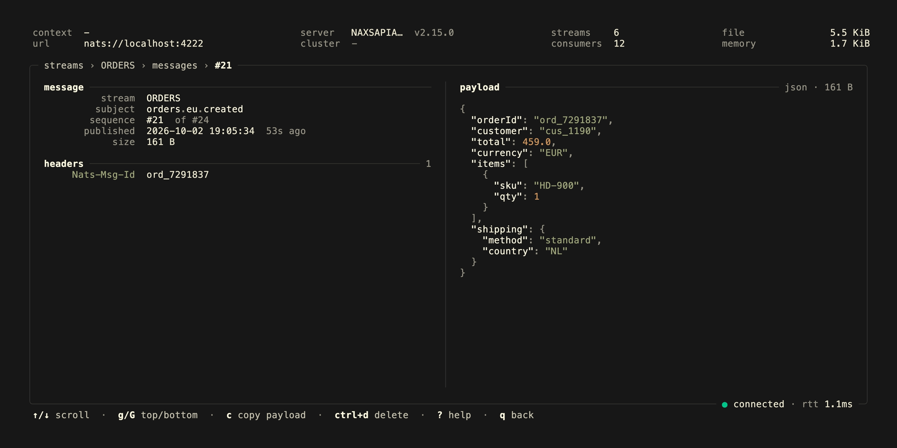
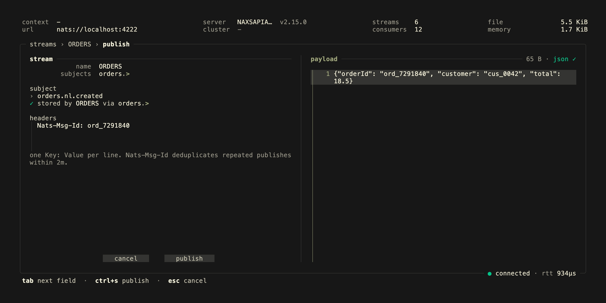
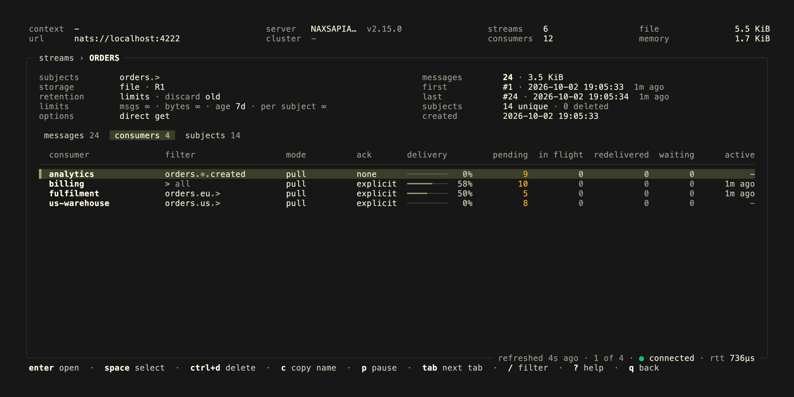
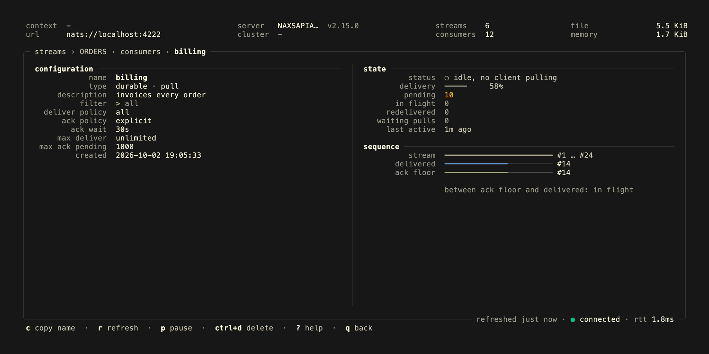

<p align="center">
  <h1 align="center">
    <a href="https://kontrolplane.dev">
      
    </a>
  </h1>
</p>

`tsui` is a terminal user interface (tui) application for managing `NATS`. It gives you a fast way to inspect and manage streams, messages and consumers directly from the terminal. Browse the newest messages of a stream without consuming them, publish messages with headers, follow consumer lag as it happens and purge or delete what you no longer need.



## views

- `stream`: overview, details, creation, delete, purge (optionally by subject)
- `subject`: per subject message counts of a stream, open one to see its messages
- `message`: details with highlighted JSON payloads, publish with live subject checking, delete
- `consumer`: details with delivery progress, pending and in flight counts, delete

The header shows the server you are connected to, the round trip time and the JetStream usage of the account.








## keybindings

- `q`: back, quit on the stream overview
- `esc`: back, clear the filter or selection, cancel a dialog or form; never quits
- `ctrl+c`: quit
- `↑`, `k`: up
- `↓`, `j`: down
- `→`, `l`: right
- `←`, `h`: left
- `g`, `G`: first/last row, top/bottom of a payload
- `pgup`, `pgdn`: page up/down
- `tab`, `shift+tab`: switch between messages, consumers and subjects; in a message's details, scroll its headers instead of the payload when there are more than fit
- `ctrl+n`: create stream/publish message
- `ctrl+d`: delete stream/message/consumer
- `ctrl+p`: purge stream, on the subjects tab the subject under the cursor
- `ctrl+s`: publish (in the publish view)
- `y`, `n`: answer a yes/no dialog
- `c`: copy message payload/consumer name/subject
- `r`: refresh, also while paused
- `p`: pause/resume the automatic refresh
- `f`: follow the newest message on the messages tab, or stop following
- `#`: go to a message by its sequence
- `?`: help
- `enter`: view, on a subject its messages
- `space`: select
- `/`: filter, subject wildcards like `orders.*.created` are supported

The messages tab starts with the newest 100 messages of a stream. Moving down past the last row loads the next older page, until the start of the stream. Messages are read by sequence, so browsing them never affects a consumer. A filter that names subjects of the stream, like `orders.eu.created` or `orders.*.created`, loads the messages on them from the server once applied with `enter`, older ones included, and the consumers tab shows the consumers receiving them; any other filter searches the loaded messages. A single word only names a subject when the stream lists it. Opening a subject from the subjects tab does the same.

While following, which is on by default, the cursor on the top row stays on the newest message as new ones arrive; off, the cursor stays on its message. Moving the cursor off the top row stops following too, the frame says `follow off` either way, and `f` jumps back to the newest message. Pausing freezes what is on screen, the header says so, and the frame shows how long ago it was refreshed.

Deleting a stream, or purging all of its messages, asks to type the stream name first. Pressing `esc` on a form with input asks again before discarding it.

While the connection to NATS is down, the data on screen stays and the frame says so. Publishing, deleting, purging and creating are refused rather than queued, so nothing is sent twice once the connection is back. A publish that gets no acknowledgement may still have been stored, check the stream before publishing again.

## installation

With [go](https://go.dev/) 1.26+ installed:

```bash
go install github.com/kontrolplane/tsui@latest
```

Prebuilt binaries for linux, macos and windows are attached to the [GitHub releases](https://github.com/kontrolplane/tsui/releases), together with a `checksums.txt` to verify the download.

A container image for linux/amd64 and linux/arm64 is published to `ghcr.io/kontrolplane/tsui`, tagged with the release version and `latest` for releases, and `main` for the latest commit on main:

```bash
docker run --rm -it --network host ghcr.io/kontrolplane/tsui:latest --server nats://127.0.0.1:4222
```

## connecting

`tsui` connects the same way as the [nats cli](https://github.com/nats-io/natscli). The context selected with `nats context select` is used by default, and flags or environment variables take precedence over the values from the context.

| flag                 | environment variable | description                                                    |
| -------------------- | -------------------- | -------------------------------------------------------------- |
| `--server`, `-s`     | `NATS_URL`           | NATS server urls, defaults to `nats://127.0.0.1:4222`          |
| `--context`          | `NATS_CONTEXT`       | nats cli context to use                                        |
| `--creds`            | `NATS_CREDS`         | user credentials file                                          |
| `--nkey`             | `NATS_NKEY`          | user nkey seed file                                            |
| `--user`             | `NATS_USER`          | username                                                       |
| `--password`         | `NATS_PASSWORD`      | password, prefer the environment variable or a context         |
| `--token`            | `NATS_TOKEN`         | authentication token                                           |
| `--tlscert`          | `NATS_CERT`          | client tls certificate, requires `--tlskey`                    |
| `--tlskey`           | `NATS_KEY`           | client tls key, requires `--tlscert`                           |
| `--tlsca`            | `NATS_CA`            | tls certificate authority                                      |
| `--tlsfirst`         |                      | perform the tls handshake before the nats protocol             |
| `--js-domain`        | `NATS_JS_DOMAIN`     | jetstream domain                                               |
| `--theme`            |                      | `auto`, the default, follows the terminal; `dark` and `light` paint their own background |
| `--debug`            |                      | write debug logs to `debug.log`                                |
| `--version`          |                      | print the version and exit                                     |
| `--help`, `-h`       |                      | print the flags and exit                                       |

```bash
tsui --context production
tsui --server nats://localhost:4222 --creds ~/.nkeys/app.creds
```

## development

tsui uses a local NATS server with JetStream enabled, running in Docker.

- [docker](https://www.docker.com/)
- [nats cli](https://github.com/nats-io/natscli)
- [jq](https://jqlang.org/)
- [earthly](https://earthly.dev/)
- [vhs](https://github.com/charmbracelet/vhs) with `ffmpeg` and `ttyd`, only to record the readme gif and screenshots
- [go](https://go.dev/) 1.26+

```bash
docker compose up -d
```

The project includes an [Earthfile](./Earthfile) with targets to quickly set up sample streams, consumers and messages for development.

**create sample streams, consumers and messages**

```bash
earthly +seed
```

**list the streams**

```bash
earthly +list
```

To show the changes made in the repository readme, the following command can be ran which automatically creates the preview gif & screenshots:

```bash
earthly +vhs
```

### running kontrolplane/tsui locally

Start NATS, create the sample resources, build and run in one go:

```bash
earthly +dev && ./build/kontrolplane/tsui --server nats://localhost:4222
```

Seeding skips streams that already exist, so this can be rerun. A consumer's `seed_ack` in the files under [seed/streams](./seed/streams) acknowledges that many messages, so the consumers show delivery progress. Remove the `volume` directory after `docker compose down` to start from scratch.

The tests start an embedded NATS server, so they do not need Docker:

```bash
go test ./...
```

## contributors

[//]: kontrolplane/generate-contributors-list

<a href="https://github.com/levivannoort"></a>

[//]: kontrolplane/generate-contributors-list

</br>

<p align="center">
  
</p>
